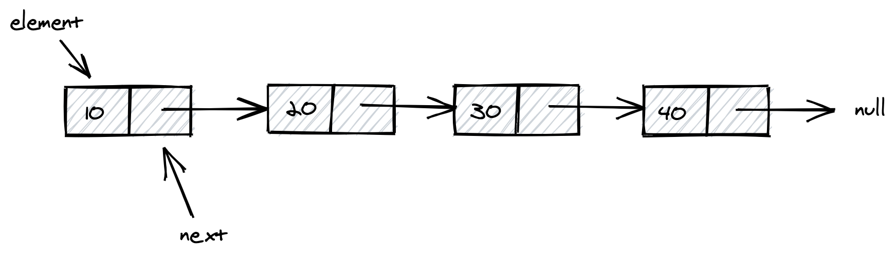

# Linked List

A linked list is a linear data structure like Array, in which the elements are not stored at contiguous memory locations and elements linked with pointers. Each node of a list is made up of two items - the `value` and a reference to the `next` node. The last node has a reference to `null` as shown in the below image:



```js
import { LinkedList } from 'rahome'

const list = new LinkedList()
list.add(10) // add 10 to list => [10]
list.add(20) // add 20 to list => [10] -> [20]
list.add(30) // add 20 to list => [10] -> [20] -> [30]

list.addFirst(5) // add 10 to list => [5] -> [10] -> [20] -> [30]
list.addLast(40) // add 40 to list => [5] -> [10] -> [20] -> [30] -> [40]

console.log(list.contains(30)) // true
console.log(list.isEmpty()) // false

console.log(list.remove(30)) // { value: 30, next: null }
console.log(list.size()) // 5
console.log(list.toString()) // 5,10,20,40
```

<!-- todo: codesandbox button add -->

Source: [LinkedList.ts](./LinkedList.ts) Codesandbox: [codesandbox](https://codesandbox.io/)

## Methods

### `constructor`

**Signature:** `LinkedList(): void`

**Description:** It will constructs an empty linked list.

**Note:** `constructs()` will ignore passed paramaters.

---

### `add(element, position)`

**Signature:** `add(element: string | string[] | number | number[] | object, position: null | number = null): LinkedList`

**Description:** Method to inserts the specified element at the specified position in list.

**Example:**

```js
const list = new LinkedList()

list.add(30) // add 30 to list
list.add(20) // add 20 to list
list.add(10, 1) // add 10 to first position
```

**Note:** Position argument should be positive integer number. if we pass negative or invalid number then it will through `invalid position` error.

---

### `addFirst(element)`

**Signature:** `addFirst(element: string | string[] | number | number[] | object): LinkedList`

**Description:** Method to inserts the specified element at the beginning of list.

**Example:**

```js
const list = new LinkedList()

list.add(20) // adds to 20 to list
list.add(30) // adds to 30 to list
list.addFirst(10) // it will add 10 to begining of list
```

---

### `addLast(element)`

**Signature:** `addLast(element: string | string[] | number | number[] | object): LinkedList`

**Description:** Method to appends the specified element to the end of list.

**Example:**

```js
const list = new LinkedList()

list.add(20) // adds to 20 to list
list.add(30) // adds to 30 to list
list.addLast(10) // it will add 10 to end of list
```

---

### `clear()`

**Signature:** `clear():void`

**Description:** Method to removes all of the elements from list.

**Example:**

```js
const list = new LinkedList()

list.add(20) // adds to 20 to list
list.add(30) // adds to 30 to list

list.clear() // this line will remove all elements from list
```

---

### `contains(element)`

**Signature:** `contains(element: string | number | object | string[] | number[]): boolean`

**Description:** Method to check element is contains into the list. It will returns `true` if this list contains the specified element else return `false`.

**Example:**

```js
const list = new LinkedList()
list.add(10) // adds to 10 to list
list.add(20) // adds to 20 to list
list.add(30) // adds to 30 to list
list.contains(10) // this line will return true
list.contains(40) // this line will return false
```

---

### `isEmpty()`

**Signature:** `isEmpty(): boolean`

**Description:** Method to check list is empty or not. It will return `true` if list is empty else return `false`.

**Example:**

```js
const list = new LinkedList()
list.isEmpty() // returns true
list.add(10) // adds 10 to list
list.isEmpty() // returns false
```

---

### `remove(element)`

**Signature:** `remove(element: string | string[] | number | number[] | object): Node | null`

**Description:** Method to retrieves and removes element from the list. If element is not found then it will `null` value.

**Example:**

```js
const list = new LinkedList()
list.add(10)
list.add(20)
list.add(30)

list.remove(10) // this will remove 10 from list.
```

---

### `removeFirst()`

**Signature:** `removeFirst(): Node | null`

**Description:** Method to remove and returns the first element from this list.

**Example:**

```js
const list = new LinkedList()

list.add(10)
list.add(20)
list.add(30)

list.removeFirst() // this will remove first element from list i.e. 10.
```

---

### `removeLast()`

**Signature:** `removeLast(): Node | null`

**Description:** Method to remove and returns the last element from this list.

**Example:**

```js
const list = new LinkedList()

list.add(10)
list.add(20)
list.add(30)

const lastElement = list.removeLast() // this will remove last element from list i.e. 30.

console.log(lastElement.value) // 30
console.log(list.toString()) // 10,20
```

---

### `size()`

**Signature:** `size(): number`

**Description:** Method to returns the number of elements in the list.

**Example:**

```js
const list = new LinkedList()

list.add(10)
list.add(20)
list.add(30)
list.add(40)

console.log(list.size()) // 4
```

---

### `toArray()`

**Signature:** `toArray(): Node[]`

**Description:** Method to returns an array containing all of the elements in list.

**Example:**

```js
const list = new LinkedList()

list.add(10)
list.add(20)
list.add(30)
list.add(40)

console.log(list.toArray()) // [node, node, node, node]
```

---

### `toString()`

**Signature:** `toString(): Node[]`

**Description:** Method to returns string representation of list.

**Example:**

```js
const list = new LinkedList()

list.add(10)
list.add(20)
list.add(30)
list.add(40)

console.log(list.toString()) // 10,20,30,40
```
