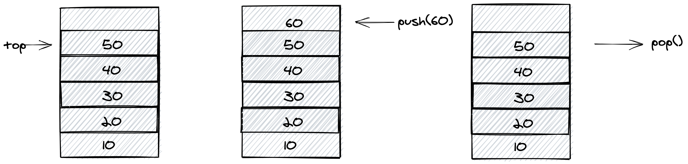

# Stack

A stack is an abstract data type that serves as a collection of elements, with two principal operations: `push` and `pop`. Order of element to be inserted is `last-in-first-out` (LIFO) The usual `push` and `pop` operations are provided, as well as a method to `peek` at the top item on the stack, a method to test for whether the stack is empty as shown in the below image:



```js
import { Stack } from 'rahome'

const stack = new Stack()

stack.push(10)
stack.push(20)
stack.push(30)
stack.push(40)

console.log(stack.isEmpty()) // return false
console.log(stack.toString()) // 10,20,30,40

stack.pop() // remove 40 from stack
stack.pop() // remove 30 from stack

console.log(stack.toString()) // 10,20

stack.pop() // remove 20 from stack
stack.pop() // remove 10 from stack

console.log(stack.isEmpty()) // return true
console.log(stack.toString()) // ''
```

[](https://codesandbox.io/s/rahome-stack-example-379wp?fontsize=14&hidenavigation=1&theme=dark)

## Methods

### `push(element)`

**Signature:** `push(element: any): void`

**Description:** Method to push element into `Stack`.

**Example:**

```js
import { Stack } from 'rahome'

const stack = new Stack()

stack.push(10) // push 10
stack.push(20) // push 20
stack.push(30) // push 30
stack.push(40) // push 40

console.log(stack.toString()) // 10,20,30,40
```

---

### `pop()`

**Signature:** `pop(): any`

**Description:** Method to pop out element from `Stack`.

**Example:**

```js
import { Stack } from 'rahome'

const stack = new Stack()

stack.push(10) // push 10
stack.push(20) // push 20
stack.push(30) // push 30

console.log(stack.toString()) // 10,20,30

stack.pop() // remove 30 from stack
stack.pop() // remove 20 from stack
stack.pop() // remove 10 from stack

console.log(stack.isEmpty()) // return true
console.log(stack.toString()) // ''
```

---

### `toArray()`

**Signature:** `toArray(): Node[]`

**Description:** Method to returns an array containing all of the elements in Stack.

**Example:**

```js
import { Stack } from 'rahome'

const stack = new Stack()

stack.push(10) // push 10
stack.push(20) // push 20
stack.push(30) // push 30

console.log(stack.toArray()) // [10,20,30]
```

---

### `toString()`

**Signature:** `toString(): Node[]`

**Description:** Method to returns string representation of Stack.

**Example:**

```js
import { Stack } from 'rahome'

const stack = new Stack()

stack.push(10) // push 10
stack.push(20) // push 20
stack.push(30) // push 30

console.log(stack.toString()) // 10,20,30
```
